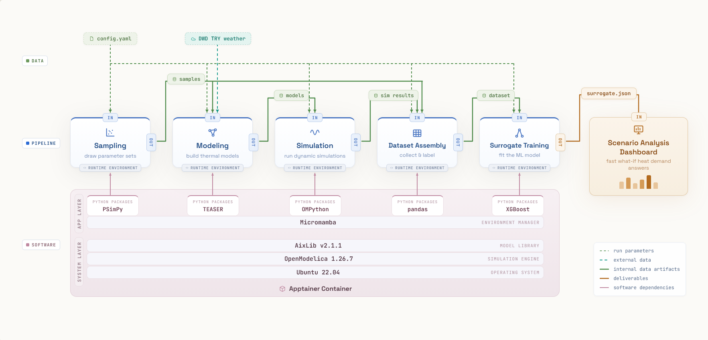

# EDpyFlow

> A containerized workflow for simulating residential heat demand and training surrogate models.


**EDpyFlow** generates synthetic building-energy data and trains machine-learning surrogate models that predict the annual heat demand of German residential buildings. It wraps the full physics-based modeling and simulation stack ([TEASER](https://github.com/RWTH-EBC/TEASER), [OpenModelica](https://openmodelica.org/), and [AixLib](https://github.com/RWTH-EBC/AixLib)) together with all required Python environments in an [Apptainer](https://apptainer.org/) container, so the entire pipeline runs reproducibly without prior Modelica experience.



- **End-to-end pipeline**: from building sampling to a trained surrogate in five self-contained steps.
- **Physics-based**: reduced-order RC thermal models generated by TEASER and simulated in OpenModelica with AixLib.
- **Fully containerized**: OpenModelica, AixLib, TEASER, and all Python environments bundled via Apptainer; no manual toolchain setup.
- **Config-driven**: a single `config.yaml` controls sampling, modeling, simulation, and surrogate training.
- **Resumable**: stages exchange data through files, so the pipeline can be entered or interrupted at any step without reprocessing upstream results.

## Pipeline

**Sampling → Modeling → Simulation → Dataset Assembly → Surrogate Training**

The pipeline proceeds in five stages. Each stage is self-contained and uses file-based data exchange.

| Stage | Description |
|-------|-------------|
| Sampling | LHS sampling of building configurations |
| Modeling | Generates thermal models with TEASER |
| Simulation | Runs dynamic energy simulations in OpenModelica |
| Dataset Assembly | Assembles simulation results into a dataset |
| Surrogate Training | Trains an XGBoost surrogate model |

## Installation

### Prerequisites

- [Apptainer](https://apptainer.org/) to build and run the container
- Weather files in `.mos` format for the six locations (see [`data/locations/README.md`](data/locations/README.md))

### Build the container

Build the container image before first use:

```bash
cd container && apptainer build EDpyFlow.sif EDpyFlow.def
```

## Quick Start

With the container built and the weather files in place:

1. Set `run_name` (and any other parameters) in `config.yaml`.
2. Run the full pipeline:

   ```bash
   python EDpyFlow.py
   ```

Outputs are written to `runs/{run_name}/`.

### Running a single stage

Each stage can also be run on its own with `--stage`, which operates on an existing run rather than starting a new one:

```bash
python EDpyFlow.py --stage modeling
```

Available stages: `sampling`, `modeling`, `simulation`, `dataset_assembly`, `surrogate_training`.

## Configuration

All parameters are set in `config.yaml`:

- `run_name`: name of the run; outputs are written to `runs/{run_name}/`
- `locations`: city names and their weather files
- `refurbishment_status`: refurbishment levels to simulate
- `sampling`: LHS parameters (samples per typology, seed, criterion)
- `num_elements`: number of RC elements in the thermal model
- `simulation`: simulation duration, timestep, and optional raw output retention
- `surrogate`: XGBoost hyperparameters, train/val/test split ratios, and model name

> **Note:** Change `run_name` for each new run to avoid overwriting previous results.

## Outputs

All outputs are written to `runs/{run_name}/`:

```
runs/{run_name}/
├── config.yaml                         ← copy of config at time of run
├── samples.csv                         ← building configurations (Sampling)
├── simulation_input/                   ← Modelica packages (Modeling)
│   ├── residentials_berlin/
│   └── ...
├── simulation_output/                  ← simulation results (Simulation)
│   ├── sim_results_berlin.json
│   └── ...
├── logs/
│   ├── simulation_{timestamp}.log      ← simulation log (Simulation)
│   └── workflow_{timestamp}.log        ← workflow log
├── synthetic_dataset/
│   └── dataset.csv                     ← training dataset (Dataset Assembly)
└── models/
    └── {model_name}.json               ← trained surrogate model (Surrogate Training)
```

## Contributors

This project was developed by Nazanin Bagherinejad, with contributions from:

- V Mithlesh Kumar — Apptainer containerization

## License

This repository is licensed under the [MIT License](LICENSE).

It includes an Apptainer definition file used to build the container environment. Third-party software installed during the build remains subject to its respective licenses. Users are responsible for ensuring compliance with those licenses when building or redistributing container images.

## Acknowledgments

This work was performed as part of the ENERsyte project and received funding from Innovationsförderagentur.NRW through the Grüne Gründungen.NRW initiative of the Ministry for the Environment, Nature Conservation and Transport of the State of North Rhine-Westphalia within the framework of the EFRE/JTF-Programme NRW 2021-2027, Co-funded by the European Union (EFRE-20800324).

## Contact

For questions, please contact [bagherinejad@mbd.rwth-aachen.de](mailto:bagherinejad@mbd.rwth-aachen.de) or open an issue at [https://github.com/mbd-rwth/EDpyFlow/issues](https://github.com/mbd-rwth/EDpyFlow/issues).
